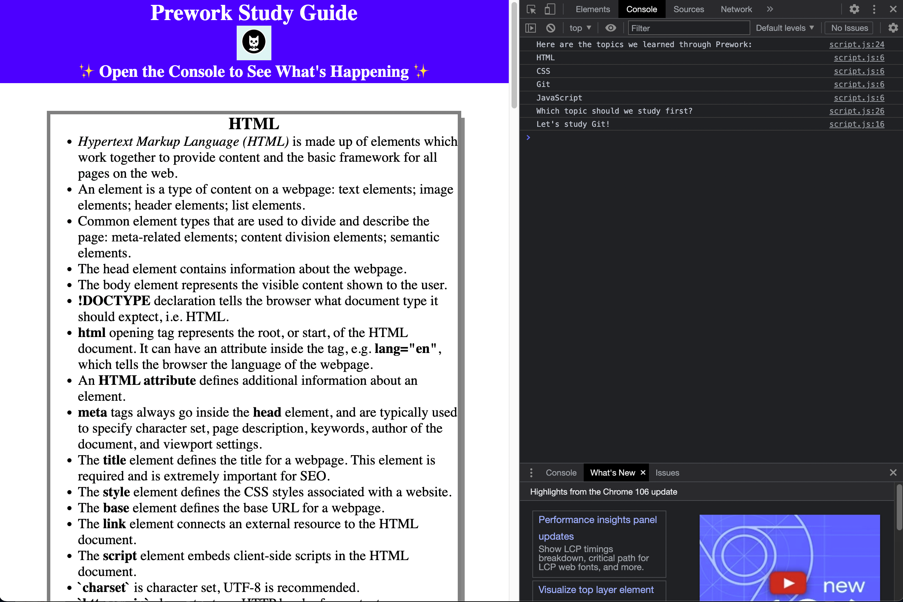

# Prework Study Guide Webpage

## Description

This Prework Study Guide was created for boot camp students who were going through the Prework. It contains notes on HTML, CSS, Git, and JavaScript. 

The motivation in creating the Guide was as a way of synthesising the large amount of new information presented to students. The Prework is a way of introducing inexperienced coders to a few key concepts in full stack web development. This Prework Study Guide therefore takes this introduction and breaks it down further. Boot camp students can refer to it as they further add to their knowledge base.

It can be hard to know where to begin study. As such, a topic selector was built into the webpage.

## Installation

N/A

## Usage

The user 

To use this Prework Study Guide, you can review the notes in each section. For suggestions on what to study first, open the Chrome DevTools by pressing Command+Option+I (macOS) or Control+Shift+I (Windows). A console panel should open either below or to the side of the webpage in the browser. There you will see a list of topics we learned from the prework along with a suggestion on which topic to study first. See the screen shot above for an illustration of what this looks like.

## Credits

N/A

## License

Copyright (c) 2022 mqas1

Licensed under the MIT license.